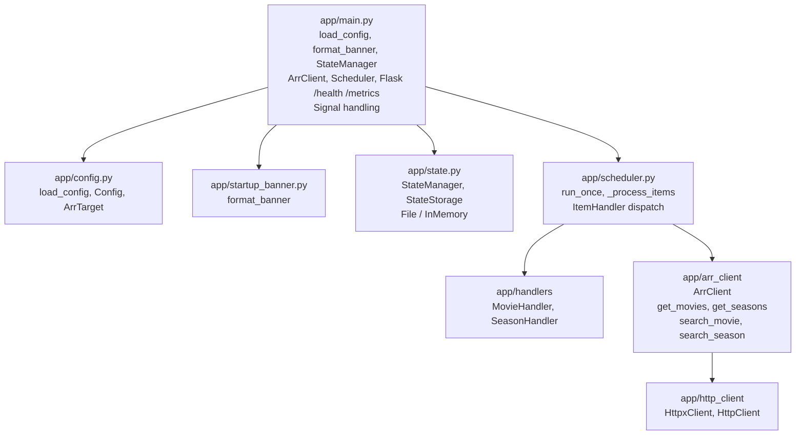

# SYSTEM.md — Gatherarr System Architecture

This document describes the system architecture, design decisions, and operational considerations for Gatherarr. It complements [PRD.md](PRD.md) (product requirements) and [AGENTS.md](AGENTS.md) (coding guidelines).

## Overview

Gatherarr is a worker-style daemon that periodically triggers search operations in *arr services (Radarr, Sonarr). It runs as a long-lived process, scheduling runs per target, fetching items, applying eligibility filters, triggering searches, and persisting state.

**Core invariants:**

- Configuration comes from environment variables only; no file-based config.
- All initialization happens once in `app/main.py`; no global accessors.
- Dependencies are passed explicitly; modules do not read environment variables.
- State is minimal and persisted to a single YAML file with atomic writes.

## Component Architecture

### Main Module (`app/main.py`)

The single entry point. Responsibilities:

1. **Load config** — `load_config()` reads environment variables, validates, and builds `Config`. Fails fast on validation errors.
2. **Setup logging** — Structured JSON logging via structlog; sensitive fields redacted.
3. **Startup banner** — Emits full configuration to logs (global and per-target) via `format_banner()`. API keys are redacted.
4. **State** — Chooses `FileStateStorage` or `InMemoryStateStorage` (when `state_file_path` is None). Loads state on startup.
5. **HTTP and Arr clients** — Creates a shared `httpx.AsyncClient` and `HttpxClient` wrapper; one `ArrClient` per target.
6. **Scheduler** — Starts async scheduler loop. Runs until shutdown signal.
7. **Web server** — Flask always serves `/health` in a daemon thread; when metrics enabled, `/metrics` is also served. Both use `listen_address` and `listen_port`.
8. **Shutdown** — On SIGTERM/SIGINT: stop scheduler, cancel task, close HTTP client.

**Assumption:** The process runs in a container; `state_file_path` is typically a mounted volume. No root required.

### Configuration (`app/config.py`)

- **Source:** Environment variables with `GTH_` prefix. No config files.
- **Validation:** Fail fast on missing required vars, invalid values, unrecognized `GTH_*` keys (typo detection).
- **Target discovery:** Sequential indices `GTH_ARR_0_*`, `GTH_ARR_1_*`, … until `GTH_ARR_n_TYPE` is missing.
- **Per-target overrides:** `TargetSettings` inherit from global defaults; overrides applied per index.
- **Duplicate names:** PRD requires rejection of duplicate target names (validation in load).
- **HTTP base URL warning:** When a target `base_url` uses `http://` instead of `https://`, log a warning at config load (API keys transmitted in cleartext over HTTP).

**Design decision:** Reject unrecognized `GTH_*` variables to surface typos and obsolete config early.

### Startup Banner (`app/startup_banner.py`)

- **Purpose:** Emit an easily readable copy of full configuration at startup so users can verify per-target configuration.
- **Format:** Text banner with global settings and per-target settings (name, type, base_url, resolved overrides).
- **Security:** API keys are omitted; displayed as `[REDACTED]`.
- **Timing:** Printed directly to stdout immediately after logging is configured, before scheduler starts. Uses `print()` rather than the logging module so the banner's formatting is preserved (no JSON wrapping or log metadata).

### Scheduler (`app/scheduler.py`)

- **Loop:** Every 1 second, checks which targets are due (based on `interval_s` since last run). Runs due targets concurrently via `asyncio.gather`.
- **Per-target run:** Fetches items via `ArrClient`, selects handler by target type (Radarr → MovieHandler, Sonarr → SeasonHandler), processes items via `ItemHandler` protocol.
- **Revisit and backoff:** The Scheduler is responsible for deciding when an item should *not* be searched because it was processed recently. For each item it looks up `ItemState` (from `StateManager`) and applies: (1) **Success revisit** — if `last_status == SUCCESS` and `time_since_last < item_revisit_s`, skip; (2) **Failure backoff** — if `last_status != SUCCESS`, compute exponential backoff from `search_retry_initial_delay_s`, `search_retry_backoff_exponent`, `search_retry_max_delay_s` and `consecutive_failures`; skip if `time_since_last` is less than backoff; (3) **Max attempts** — if `search_retry_max_attempts > 0` and `consecutive_failures >= search_retry_max_attempts`, skip permanently. Handlers do not participate in revisit/backoff decisions.
- **Item processing order:** Extract logging ID → extract item ID → state/backoff checks → eligibility (`should_search`) → search (or dry-run).
- **Metrics:** Updates `run_total`, `grabs_total`, `skips_total`, `request_errors_total`, etc.
- **State:** Persists after each run; increments `total_runs`.

**Assumption:** Handler is selected by `ArrType`; scheduler has no item-type-specific logic beyond handler dispatch.

### ItemHandler Protocol and Handlers

The scheduler delegates all item-type logic to `ItemHandler` implementations. This keeps the scheduler generic and supports Fake implementations for tests.

#### ItemId

Item identifiers extend `ItemId`:

- `format_for_state() -> str` — Deterministic key for state lookup (e.g. `"42"` for movies, `"123:4"` for series/season).
- `logging_ids() -> dict[str, Any]` — Correlation fields for logs (`movie_id`, `movie_name` or `series_id`, `season_number`, `series_name`).

#### ItemHandler Methods

| Method | Purpose | Returns |
|--------|---------|---------|
| `extract_item_id(item)` | ID for state and revisit timing | `ItemId \| None` |
| `extract_logging_id(item)` | Logging correlation dict | `dict[str, str]` |
| `should_search(item, logging_ids)` | Eligibility rules (monitored, cutoff, tags, etc.) | `bool` |
| `search(client, item, logging_ids)` | Trigger search and log action | `None` (async) |

**Call order:** `extract_logging_id` → `extract_item_id` → state/backoff checks → `should_search` → `search`.

**Extensibility:** New *arr apps (e.g. Lidarr) require a handler, an `ItemId` subclass, and ArrClient search methods. Scheduler only needs to map the new type to its handler.

### ArrClient (`app/arr_client.py`)

- **HTTP layer:** Uses `HttpClient` protocol (injected; real impl: `HttpxClient`).
- **Retries:** Tenacity for network errors, timeouts, 5xx, 429. Configurable `http_max_retries`, `http_retry_initial_delay_s`, `http_retry_backoff_exponent`, `http_retry_max_delay_s` (global and per-target).
- **Auth:** `X-Api-Key` header per target.
- **Endpoints:** Radarr `GET /api/v3/movie`, `POST /api/v3/command` (MoviesSearch); Sonarr `GET /api/v3/series`, flatten to seasons, `POST /api/v3/command` (SeasonSearch).

**Assumption:** *arr API contracts (JSON shape, field names) are stable; no defensive type checks per AGENTS.md.

### State (`app/state.py`)

- **Model:** `State` → `targets[name]` → `TargetState` → `items[item_id]` → `ItemState`.
- **Persistence:** `StateStorage` protocol. `FileStateStorage` uses atomic write (temp file → fsync → rename).
- **Corruption:** On YAML parse or deserialization error, move file to `.corrupt.<timestamp>`, start fresh.
- **Size cap:** State file is capped at 10 MB. When the serialized state would exceed this limit, the oldest item entries (by `last_processed_timestamp`) are pruned until within cap.

**Design decision:** Atomic write ensures no partial state on crash. Corrupt files are preserved for debugging.

### Logging and Metrics

- **Structured logs:** structlog, JSON to stdout/stderr. Correlation fields: `target_name`, `target_type`, `run_id`, `movie_id`/`series_id`/`season_number`.
- **Redaction:** `log_redaction.redact_sensitive_fields` removes `api_key`, `apikey`, `x-api-key`, etc. from all log output.
- **Log levels:** INFO for actions that affect targets (searches); DEBUG for fetches, internal steps.
- **Health:** `/health` always served for liveness/readiness. **Metrics:** Prometheus counters/gauges/histograms; served on `/metrics` when enabled. `gatherarr_requests_total` and `gatherarr_request_errors_total` are recorded in ArrClient for every API request (list movies/series and execute searches), broken down by target (server), type (radarr/sonarr), and operation (get_movies, get_seasons, search_movie, search_season).

## Design Decisions and Assumptions

### Single Initialization Point

All config, state, and client setup happens in `main()`. No module reads env vars or uses global accessors. This simplifies testing (inject config) and reasoning about startup order.

### Explicit Dependency Injection

`ArrClient` receives `HttpClient`; `Scheduler` receives `StateManager` and `arr_clients`; handlers receive `ArrTarget`. Fakes replace real implementations in tests without mocks.

### No Defensive API Checks

Per AGENTS.md, we do not add checks like `isinstance(x, bool)` when expecting `int`. Incorrect assumptions about *arr responses should surface as exceptions, not silent misbehavior.

### Configuration Strictness

Unrecognized `GTH_*` variables cause startup failure. This avoids silent typos and forces cleanup of obsolete config.

## Security

- **Container:** The image runs as a non-root user with no privileged operations; this is an architectural constraint of the deployment model.

## Robustness

- **HTTP retries:** Network errors, 5xx, 429 retried with exponential backoff. Non-retryable errors (e.g. 4xx) fail immediately.
- **State corruption:** Recovered by moving corrupt file aside and starting fresh. No partial state loaded.
- **Shutdown:** Scheduler stops; in-flight work completes or is cancelled. HTTP client closed cleanly.
- **Graceful shutdown:** Configurable `shutdown_timeout_s` (default 30s) caps shutdown duration. The scheduler is allowed to finish in-flight work; if it does not stop within the timeout, the task is cancelled.

## Testability

- **Fake objects:** `FakeArrClient`, `FakeClientWithError`, `InMemoryStateStorage` implement protocols. Tests inject them.
- **No mocks:** Per AGENTS.md, prefer Fakes over `unittest.mock`. Fakes are configurable (e.g. raise error, return ineligible items).
- **Config injection:** `load_config(env=...)` accepts a dict for deterministic tests.
- **Protocols:** `ItemHandler`, `StateStorage`, `HttpClient` enable substitution without changing production code.

## Extensibility

- **New *arr apps:** Add `ArrType`, handler, `ItemId` subclass, ArrClient methods. Wire handler in scheduler by type.
- **New eligibility rules:** Implement in handler `should_search`; scheduler unchanged.
- **New storage:** Implement `StateStorage`; `StateManager` unchanged.
